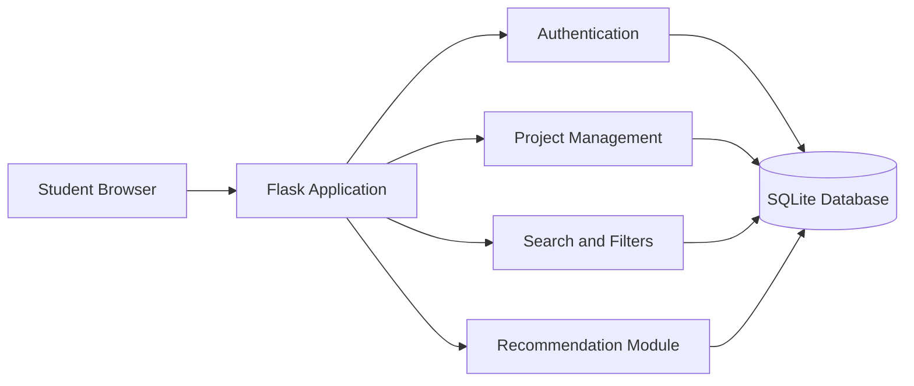
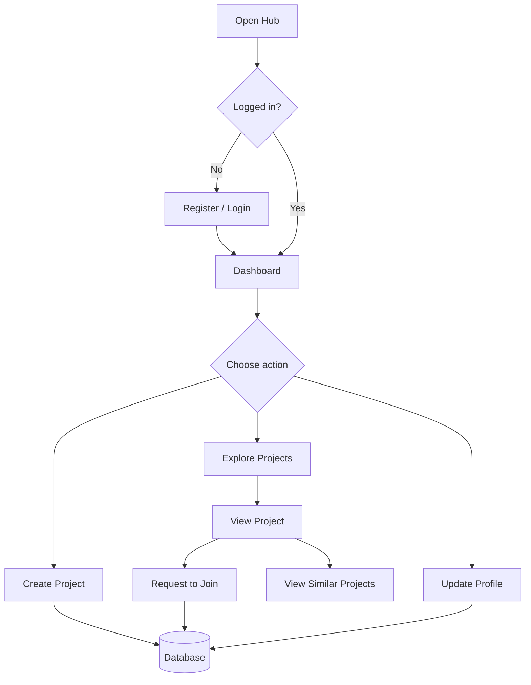
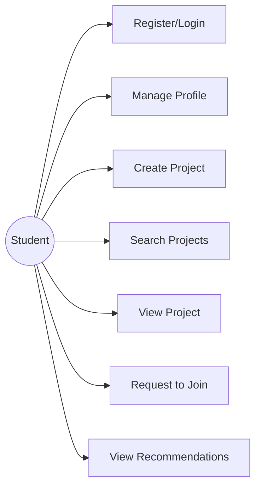
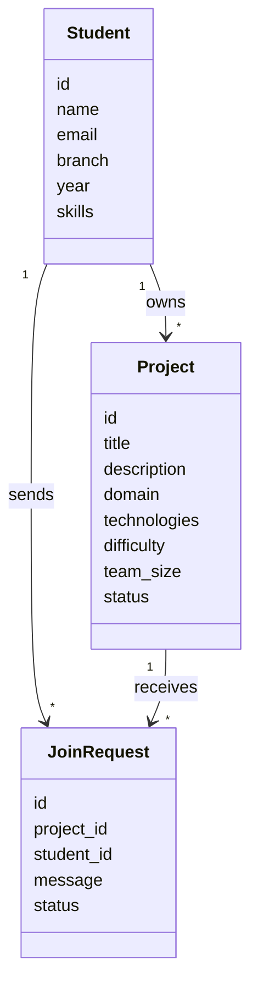
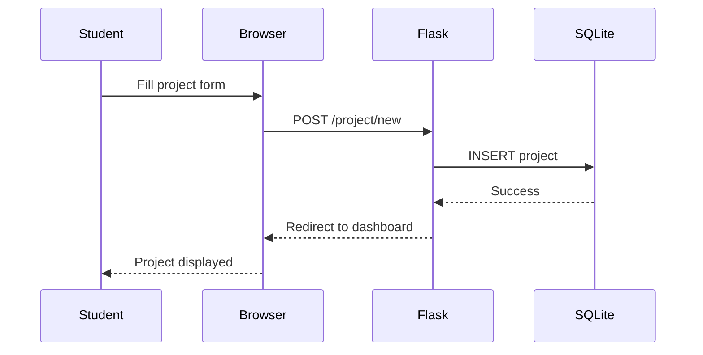
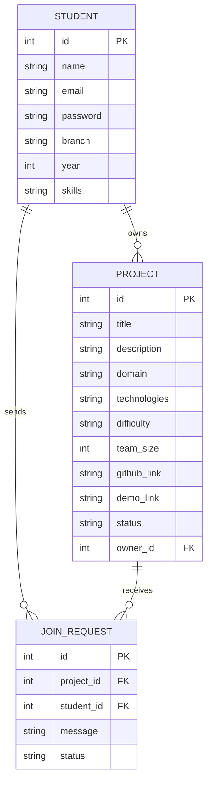

# Diagram Guide

These Mermaid diagrams can be pasted into a Mermaid-compatible editor or drawn manually for the report.

## System Architecture

## Workflow

## Use Case

## Class/Component

## Sequence: Add Project

## ER Diagram

